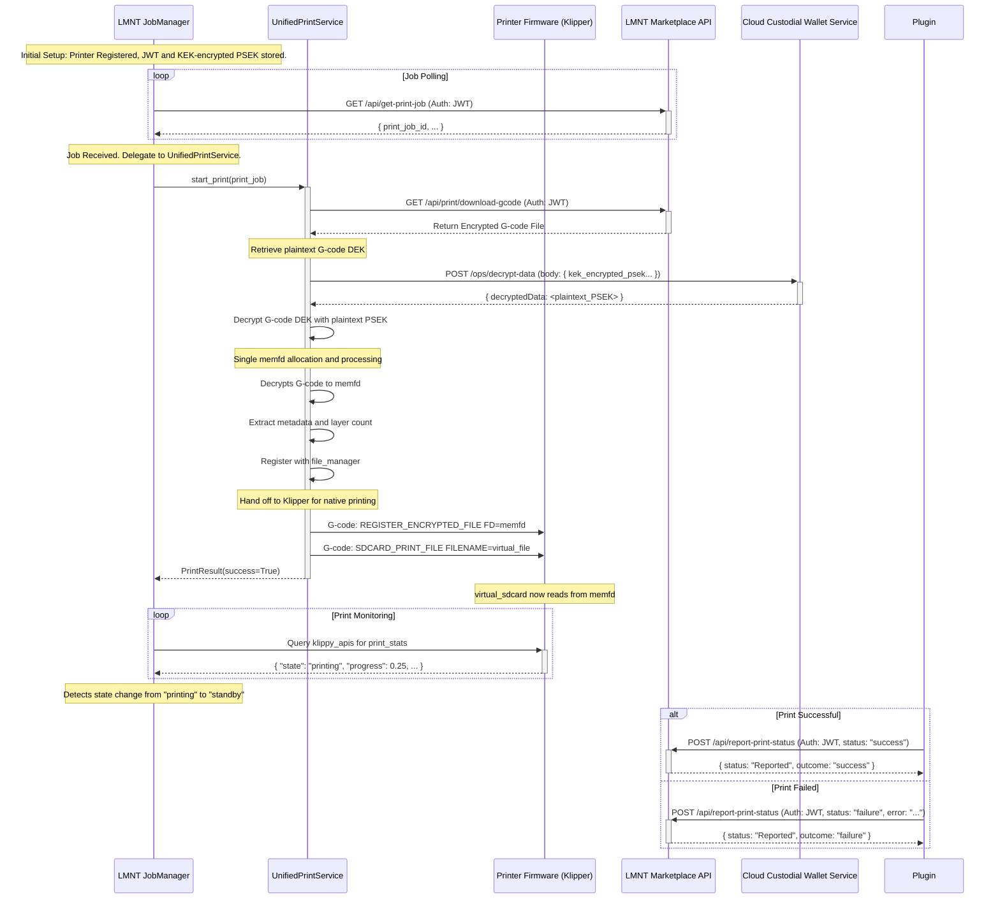

# LMNT Marketplace Plugin Workflow

This document outlines the operational flow of the LMNT Marketplace Plugin (`lmnt_marketplace_plugin.py`), detailing how it interacts with the Klipper/Moonraker ecosystem and the LMNT Marketplace APIs to facilitate secure 3D printing of purchased models.

## 1. Overview

The LMNT Marketplace Plugin is designed to run on a 3D printer (typically alongside Klipper and Moonraker). Its primary responsibilities are:
- Authenticating and Registering with the LMNT Marketplace.
- Fetching authorized print jobs.
- Securely retrieving and decrypting G-code for printing.
- Streaming G-code to Klipper for execution via the UnifiedPrintService.
- Reporting the final print status back to the marketplace.

## 2. Printer Registration

Each printer is associated with a marketplace User ID, and it must be registered before it can fetch print jobs. There are several API andpoints that run on the LMNT Marketplace Plugin that are intended to be used with a local web interface, likely integrated into Mainsail/Fluidd that help facilitate the User Login and Printer Registration process.

1.  **User Login (Prerequisite)**: 
    *   The user logs into the marketplace using their email and password by posting to the Printers API endpoint via a Moonraker RPC method at `POST /machine/lmnt_marketplace/login_user`.
    *   The Printers API coordinates with the Marketplace API to authenticate the user, retrieve their account information, and return their User JWT.
    *   This JWT should be used to call the /api/register-printer endpoint with the printer's name and description.

2.  **Printer Registration & Key Management**:
    *   **Identity Keypair Generation**: Upon first registration via `POST /machine/lmnt_marketplace/register_printer`, the plugin generates a persistent public/private keypair (`NaCl PrivateKey`). This keypair serves as the printer's unique, long-term identity.
    *   **Secure Key Storage**: The **private key** is stored securely on the printer's local filesystem and **never leaves the device**.
    *   **Public Key Registration**: The corresponding **public key** is sent to the LMNT Marketplace and associated with the printer's account. This public key allows the marketplace to encrypt data specifically for this printer.
    *   **Authentication**: The marketplace issues a long-lived JSON Web Token (JWT) to the printer for authenticating subsequent API requests.

## 3. Print Job Acquisition

The plugin periodically polls the marketplace to check for new print jobs.

1.  **Polling Endpoint**: `GET /api/poll-print-queue`
2.  **Authentication**: The request includes the printer's JWT in the authorization header.
3.  **Job Creation (Marketplace-Side)**:
    *   When a user sends a job to the printer, the marketplace generates a new, single-use **Data Encryption Key (DEK)**.
    *   The G-code file is encrypted using this DEK.
    *   The DEK itself is then encrypted using the printer's **public key**. This results in an encrypted package (`gcode_dek_package`) that only the printer can open.
4.  **Response (Success - Job Available)**: If a job is available, the API returns a JSON payload containing:
    *   `print_job_id` (string): Unique identifier for this print job.
    *   `encrypted_gcode_download_url` (string): A direct URL to download the encrypted G-code file.
    *   `gcode_dek_package` (string): The DEK, encrypted with the printer's public key. Only the printer's private key can decrypt this package.
    *   `gcode_iv_hex` (string): The Initialization Vector (IV) used for G-code encryption.
    *   Other relevant job details.

## 4. G-code Decryption and Secure Streaming

Once the plugin receives the job details, it uses the UnifiedPrintService to securely decrypt and print the model without ever writing the decrypted G-code to disk.

1.  **Fetch Encrypted G-code**: The plugin downloads the encrypted G-code from the `encrypted_gcode_download_url`.

2.  **UnifiedPrintService Handling**:
    *   The JobManager delegates print handling to the UnifiedPrintService, which centralizes all encrypted print logic.
    *   This service handles the entire workflow from decryption to print start, using a single memory-efficient process.

3.  **Decrypt the Data Encryption Key (DEK)**:
    *   The UnifiedPrintService uses the printer's unique **private key** (stored locally) to decrypt the `gcode_dek_package`.
    *   This reveals the plaintext **DEK**, which is the key needed to decrypt the actual G-code file.

4.  **Decrypt G-code to Single In-Memory File**:
    *   Using the plaintext DEK and the provided IV (`gcode_iv_hex`), the service decrypts the G-code content.
    *   The decrypted content is placed into a single anonymous, in-memory file using the Linux `memfd_create` syscall.
    *   **Resource Efficiency**: Only one memfd allocation is used per print job, reducing memory usage by ~67% compared to previous implementations.
    *   **Security Note**: The decrypted G-code exists only in RAM, preventing unauthorized access.

5.  **Metadata Extraction and Layer Count Detection**:
    *   The service parses the decrypted G-code in memory to extract metadata like estimated print time and filament usage.
    *   Layer count is detected through regex pattern matching in the header and footer sections.
    *   This metadata is used for UI progress display and print statistics.

6.  **Securely Stream to Klipper**: The UnifiedPrintService hands off the in-memory G-code to Klipper for native printing.
    a.  **Register File Descriptor**: The service calls `REGISTER_ENCRYPTED_FILE` to pass the file descriptor to Klipper.
    b.  **Initiate Print**: The service starts the print using the `SDCARD_PRINT_FILE` command with proper metadata registration.
    c.  **Native Integration**: The print job is fully integrated with Klipper's print system and Moonraker's file manager.

## 5. Print Status Monitoring and Reporting

With Klipper handling the print natively, the plugin integrates seamlessly with Moonraker's print tracking system and monitors for completion.

### Native Print Stats Integration

1.  **Moonraker Integration**: The plugin registers encrypted prints with Moonraker's core components:
    *   **File Manager**: Registers the print job with a virtual file path (`gcodes/{filename}`) for proper tracking
    *   **Print Stats**: Notifies Moonraker's `print_stats` component of print start and metadata
    *   **Virtual SD Card**: Sets the current file in Klipper's `virtual_sdcard` for native print controls

2.  **Layer Progress Tracking**: Proper layer progress is achieved through:
    *   **Total Layer Count**: Extracted from GCode metadata and set via `SET_PRINT_STATS_INFO TOTAL_LAYER={count}`
    *   **Current Layer Updates**: OrcaSlicer profiles include `SET_PRINT_STATS_INFO CURRENT_LAYER={layer_num + 1}` commands
    *   **UI Integration**: Mainsail/Fluidd display "Layer X of Y" progress naturally through Klipper's print stats

3.  **Print Controls**: Standard print controls (pause, resume, cancel) work seamlessly:
    *   Moonraker's file manager enables UI controls
    *   Klipper handles print state transitions natively
    *   No custom notifications interfere with the standard workflow

### Job Monitoring and Completion Detection

4.  **Monitor Print Progress**: The plugin starts a background monitoring task (`_monitor_print_progress`) that:
    *   Periodically queries Klipper's `print_stats` object via Moonraker's `klippy_apis`
    *   Tracks print state transitions without interfering with native tracking
    *   Monitors for job completion while preserving standard UI behavior

5.  **Detect Job Completion**: Completion is detected by watching the `print_stats.state` field:
    *   **Terminal States**: `"standby"`, `"complete"`, or `"error"` indicate print completion
    *   **State Transitions**: Monitors transition from `"printing"` to terminal states
    *   **Resilient Detection**: Method works across Klipper restarts and connection issues

6.  **Report Final Status**: Once completion is detected, the plugin reports to the marketplace:
    *   **Endpoint**: `POST /api/report-print-status`
    *   **Authentication**: Request includes the printer's long-lived JWT
    *   **Payload**: JSON with `print_job_id` and final `status` (`"success"` or `"failure"`)
    *   **Cleanup**: Monitoring task terminates and resources are cleaned up

7.  **Marketplace Actions**: The marketplace API processes the report:
    *   Updates the purchase record with final print outcome
    *   Logs the completion event for analytics and billing
    *   Enables any post-print workflows (notifications, ratings, etc.)

## Workflow Diagram

