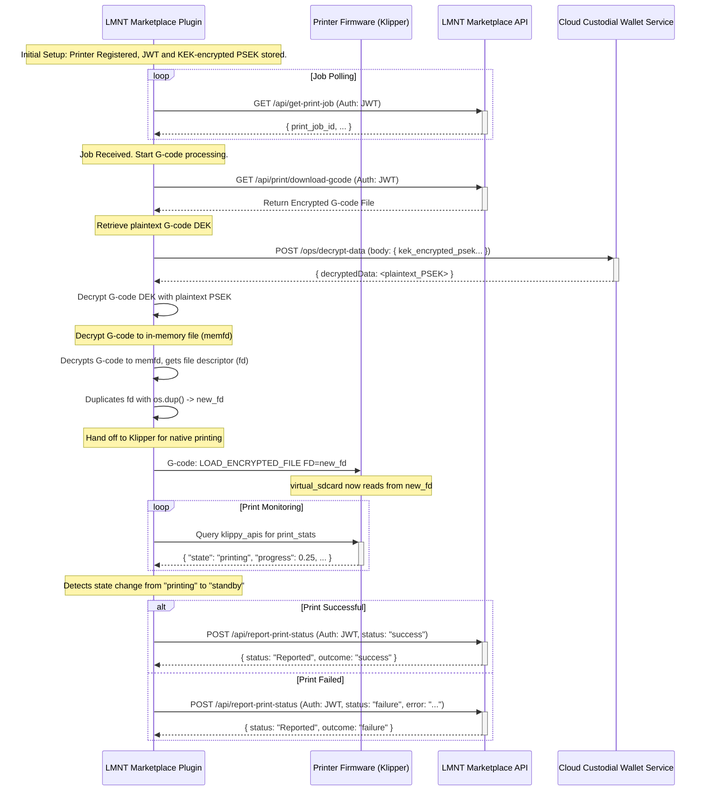

# LMNT Marketplace Plugin Workflow

This document outlines the operational flow of the LMNT Marketplace Plugin (`lmnt_marketplace_plugin.py`), detailing how it interacts with the Klipper/Moonraker ecosystem and the LMNT Marketplace APIs to facilitate secure 3D printing of purchased models.

## 1. Overview

The LMNT Marketplace Plugin is designed to run on a 3D printer (typically alongside Klipper and Moonraker). Its primary responsibilities are:
- Authenticating and Registering with the LMNT Marketplace.
- Fetching authorized print jobs.
- Securely retrieving and decrypting G-code for printing.
- Streaming G-code to Klipper for execution.
- Reporting the final print status back to the marketplace.

## 2. Printer Registration

Each printer is associated with a marketplace User ID, and it must be registered before it can fetch print jobs. There are several API andpoints that run on the LMNT Marketplace Plugin that are intended to be used with a local web interface, likely integrated into Mainsail/Fluidd that help facilitate the User Login and Printer Registration process.

1.  **User Login (Prerequisite)**: 
    *   The user logs into the marketplace using their email and password by posting to the Printers API endpoint via a Moonraker RPC method at `POST /machine/lmnt_marketplace/login_user`.
    *   The Printers API coordinates with the Marketplace API to authenticate the user, retrieve their account information, and return their User JWT.
    *   This JWT should be used to call the /api/register-printer endpoint with the printer's name and description.

2.  **Printer Registration & Key Management**:
    *   **Identity Keypair Generation**: Upon first registration via `POST /machine/lmnt_marketplace/register_printer`, the plugin generates a persistent public/private keypair (`NaCl PrivateKey`). This keypair serves as the printer's unique, long-term identity.
    *   **Secure Key Storage**: The **private key** is stored securely on the printer's local filesystem and **never leaves the device**.
    *   **Public Key Registration**: The corresponding **public key** is sent to the LMNT Marketplace and associated with the printer's account. This public key allows the marketplace to encrypt data specifically for this printer.
    *   **Authentication**: The marketplace issues a long-lived JSON Web Token (JWT) to the printer for authenticating subsequent API requests.

## 3. Print Job Acquisition

The plugin periodically polls the marketplace to check for new print jobs.

1.  **Polling Endpoint**: `GET /api/poll-print-queue`
2.  **Authentication**: The request includes the printer's JWT in the authorization header.
3.  **Job Creation (Marketplace-Side)**:
    *   When a user sends a job to the printer, the marketplace generates a new, single-use **Data Encryption Key (DEK)**.
    *   The G-code file is encrypted using this DEK.
    *   The DEK itself is then encrypted using the printer's **public key**. This results in an encrypted package (`gcode_dek_package`) that only the printer can open.
4.  **Response (Success - Job Available)**: If a job is available, the API returns a JSON payload containing:
    *   `print_job_id` (string): Unique identifier for this print job.
    *   `encrypted_gcode_download_url` (string): A direct URL to download the encrypted G-code file.
    *   `gcode_dek_package` (string): The DEK, encrypted with the printer's public key. Only the printer's private key can decrypt this package.
    *   `gcode_iv_hex` (string): The Initialization Vector (IV) used for G-code encryption.
    *   Other relevant job details.

## 4. G-code Decryption and Secure Streaming

Once the plugin receives the job details, it uses a secure, two-step process to decrypt and print the model without ever writing the decrypted G-code to disk.

1.  **Fetch Encrypted G-code**: The plugin downloads the encrypted G-code from the `encrypted_gcode_download_url`.

2.  **Step 1: Decrypt the Data Encryption Key (DEK)**:
    *   The plugin uses the printer's unique **private key** (stored locally) to decrypt the `gcode_dek_package`.
    *   This reveals the plaintext **DEK**, which is the key needed to decrypt the actual G-code file. This step ensures that only the intended printer can access the G-code's key.

3.  **Step 2: Decrypt G-code to In-Memory File**:
    *   Using the now-plaintext DEK and the provided IV (`gcode_iv_hex`), the plugin decrypts the entire G-code file's content.
    *   Instead of writing it to disk, it places the decrypted content into an anonymous, in-memory file using the Linux `memfd_create` syscall.
    *   **Security Note**: This is the core of the security model. The decrypted G-code exists only in RAM, preventing unauthorized access.

4.  **Securely Stream to Klipper**: The plugin hands off the in-memory G-code to Klipper for native printing.
    a.  **Register File Descriptor**: The plugin calls a custom Klipper command (`REGISTER_ENCRYPTED_FILE`) to pass the file descriptor of the in-memory G-code to Klipper.
    b.  **Initiate Print via Virtual Filename**: The plugin starts the print using the standard `SDCARD_PRINT_FILE` command with a specially crafted `virtual_` filename.
    c.  **Macro Interception**: A G-code macro in `printer.cfg` intercepts this command, sees the `virtual_` prefix, and redirects the call to the `secure_print.py` module, which handles the final handoff to Klipper's print system.

## 5. Print Status Monitoring and Reporting

With Klipper handling the print natively, the plugin's role shifts to monitoring for completion.

1.  **Monitor Klipper State**: The plugin starts a monitoring task (`_monitor_print_progress`) that periodically queries Klipper's `print_stats` object via Moonraker's `klippy_apis`.
2.  **Detect Job Completion**: It robustly determines the job's end by watching the `print_stats.state` field. A transition from `"printing"` to a terminal state (`"standby"`, `"complete"`, or `"error"`) signals that the print has finished. This method is resilient to Klipper restarts.
3.  **Report Final Status**: Once a terminal state is detected, the plugin reports the final outcome to the marketplace.
    *   **Endpoint**: `POST /api/report-print-status`
    *   **Authentication**: The request includes the printer's long-lived JWT.
    *   **Request Body**: A JSON payload with the `print_job_id` and the final `status` (`"success"` or `"failure"`).
4.  **Marketplace Actions**: The marketplace API processes the report, updates the purchase record, and logs the event.

## Workflow Diagram

