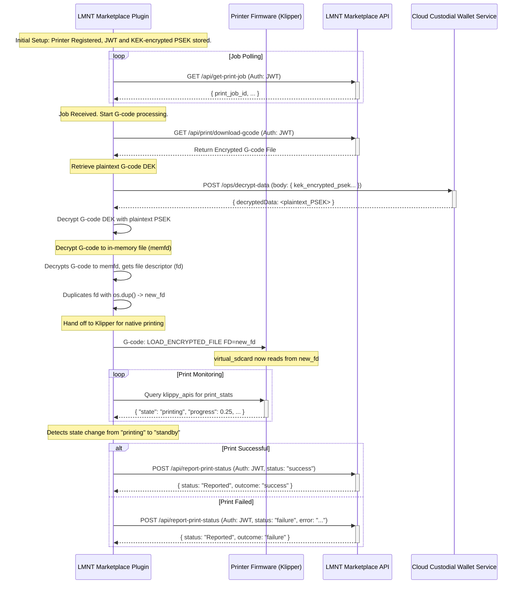

# LMNT Marketplace Plugin Workflow

This document outlines the operational flow of the LMNT Marketplace Plugin (`lmnt_marketplace_plugin.py`), detailing how it interacts with the Klipper/Moonraker ecosystem and the LMNT Marketplace APIs to facilitate secure 3D printing of purchased models.

## 1. Overview

The LMNT Marketplace Plugin is designed to run on a 3D printer (typically alongside Klipper and Moonraker). Its primary responsibilities are:
- Authenticating and Registering with the LMNT Marketplace.
- Fetching authorized print jobs.
- Securely retrieving and decrypting G-code for printing.
- Streaming G-code to Klipper for execution.
- Reporting the final print status back to the marketplace.

## 2. Printer Registration

Each printer is associated with a marketplace User ID, and it must be registered before it can fetch print jobs. There are several API andpoints that run on the LMNT Marketplace Plugin that are intended to be used with a local web interface, likely integrated into Mainsail/Fluidd that help facilitate the User Login and Printer Registration process.

1.  **User Login (Prerequisite)**: 
    *   The user logs into the marketplace using their email and password by posting to the Printers API endpoint via a Moonraker RPC method at `POST /machine/lmnt_marketplace/login_user`.
    *   The Printers API coordinates with the Marketplace API to authenticate the user, retrieve their account information, and return their User JWT.
    *   This JWT should be used to call the /api/register-printer endpoint with the printer's name and description.

2.  **Printer Registration (Prerequisite)**: 
    *   A printer is registered with the Marketplace API via the `/api/register-printer` endpoint. The plugin provides an API endpoint which is exposed as an Moonraker RPC method: `POST /machine/lmnt_marketplace/register_printer` - so it can be called as such: `http://mainsail.lmnt.local/machine/lmnt_marketplace/register_printer`. During this process, a unique plaintext Printer-Specific Encryption Key (PSEK) is generated for the printer. 
    *   The Marketplace API coordinates with the Cloud Custodial Wallet Service (CWS) to encrypt this plaintext PSEK. This typically involves the Marketplace API calling CWS's `POST /ops/encrypt-data` endpoint with the plaintext PSEK. CWS encrypts it using its internal `masterPrinterKekCwsId` and returns the KEK-encrypted PSEK.
    *   The Marketplace API then returns this KEK-encrypted PSEK and a long-lived printer-specific JSON Web Token (JWT) to the printer/plugin.
    *   The plugin stores this KEK-encrypted PSEK (let's refer to it as `kek_encrypted_psek_for_gcode_encryption`) and the JWT locally and securely.
    *   Future enhancements may include a web interface integrated with Mainsail/Fluidd for easier user interaction.

2.  **Plugin Authentication**: 
    *   The plugin uses this long-lived JWT to authenticate all its requests to the LMNT Marketplace API endpoints (e.g., `/api/get-print-job`, `/api/report-print-status`).
    *   The plugin is responsible for securely storing and managing this JWT.
    *   It should also handle JWT refresh mechanisms if the marketplace API supports token refreshing to maintain continuous operation.

## 3. Print Job Acquisition

The plugin periodically polls the marketplace to check for new print jobs assigned to the printer.

1.  **Polling Endpoint**: `GET /api/get-print-job`
2.  **Authentication**: The request must include the valid long-lived JWT in the authorization header.
3.  **Request**: No specific request body is typically needed for polling, the endpoint can decrypt the JWT to validate the printer and retrieve important metadata like printerID and the userID its associated with.
4.  **Response (Success - Job Available)**: If a job is available, the API returns a JSON payload containing:
    *   `print_job_id` (string): Unique identifier for this print job.
    *   `purchase_id` (string): Identifier for the original purchase.
    *   `gcode_download_url_proxy`: The Marketplace API endpoint for downloading the G-code (e.g., `/api/print/download-gcode?job_id=xxx`).
    *   `psek_encrypted_gcode_dek` (string): The G-code's Data Encryption Key (DEK), which has been encrypted with the printer's plaintext PSEK (this encryption happens in the Webslicer).
    *   `kek_encrypted_psek_for_gcode_encryption` (string): The printer's PSEK, which itself has been encrypted by a CWS Key Encryption Key (KEK). This is the key the plugin needs to send to CWS to get the plaintext PSEK.
    *   Other relevant job details.
5.  **Response (Success - No Job)**: If no job is available, the API returns an appropriate response (e.g., an empty list or a specific status code).

## 4. G-code Decryption and Secure Streaming

Once the plugin receives job details, it uses a sophisticated, secure process to decrypt and print the model without ever writing the decrypted G-code to disk.

1.  **Fetch Encrypted G-code**: The plugin downloads the encrypted G-code by calling a marketplace API endpoint (`/api/print/download-gcode`), which acts as a secure proxy to the file's storage location (e.g., GCS).

2.  **Decrypt G-code DEK**: The plugin securely retrieves the G-code's Data Encryption Key (DEK). This involves:
    a.  Calling the CWS to decrypt the printer's KEK-encrypted PSEK.
    b.  Using the now-plaintext PSEK to decrypt the `psek_encrypted_gcode_dek` locally, yielding the final G-code DEK (a Fernet key).

3.  **Decrypt G-code to In-Memory File**: Using the G-code DEK, the plugin decrypts the *entire* G-code file content. Instead of writing it to disk, it places the decrypted content into an anonymous, in-memory file using the Linux `memfd_create` syscall. 
    *   **Security Note**: This is the core of the security model. The decrypted G-code exists only in RAM and is never stored on any physical disk, preventing unauthorized access or recovery.

4.  **Securely Stream to Klipper via G-Code Macro Bridge**: The plugin hands off the in-memory G-code to Klipper for native printing using a non-invasive G-code macro.
    a.  **Duplicate File Descriptor**: The plugin creates a duplicate of the in-memory file's descriptor using `os.dup()`. This is a critical step that allows safe ownership transfer to the Klipper process.
    b.  **Register FD with Secure Print Module**: The plugin calls its own Klipper extension (`secure_print.py`) via a custom `SET_GCODE_FD FD=<fd_number>` command. This makes the file descriptor available within the Klipper environment.
    c.  **Initiate Print via Virtual Filename**: The plugin tells Moonraker to start a print using the standard `SDCARD_PRINT_FILE` command, but with a specially crafted filename (e.g., `FILENAME=virtual_12345.gcode`).
    d.  **Macro Interception**: A G-code macro in `printer.cfg` intercepts the `SDCARD_PRINT_FILE` command. Seeing the `virtual_` prefix, it redirects the call to the `secure_print.py` module.
    e.  **Native Klipper Printing**: The `secure_print` module retrieves the file descriptor registered in step (b) and passes it to Klipper's `virtual_sdcard` module. Klipper then reads from this descriptor as if it were a regular file on disk, enabling full, native print management and statistics.

## 5. Print Status Monitoring and Reporting

With Klipper handling the print natively, the plugin's role shifts to monitoring for completion.

1.  **Monitor Klipper State**: The plugin starts a monitoring task (`_monitor_print_progress`) that periodically queries Klipper's `print_stats` object via Moonraker's `klippy_apis`.
2.  **Detect Job Completion**: It robustly determines the job's end by watching the `print_stats.state` field. A transition from `"printing"` to a terminal state (`"standby"`, `"complete"`, or `"error"`) signals that the print has finished. This method is resilient to Klipper restarts.
3.  **Report Final Status**: Once a terminal state is detected, the plugin reports the final outcome to the marketplace.
    *   **Endpoint**: `POST /api/report-print-status`
    *   **Authentication**: The request includes the printer's long-lived JWT.
    *   **Request Body**: A JSON payload with the `print_job_id` and the final `status` (`"success"` or `"failure"`).
4.  **Marketplace Actions**: The marketplace API processes the report, updates the purchase record, and logs the event.

## Workflow Diagram

