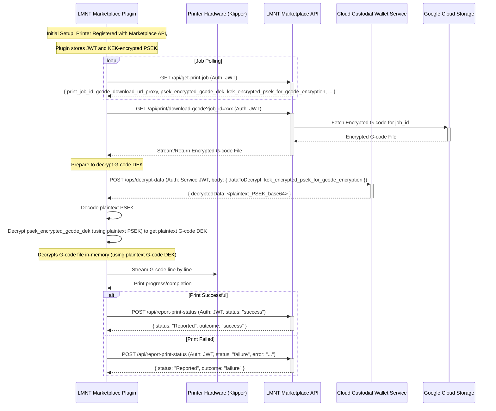

# LMNT Marketplace Plugin Workflow

This document outlines the operational flow of the LMNT Marketplace Plugin (`lmnt_marketplace_plugin.py`), detailing how it interacts with the Klipper/Moonraker ecosystem and the LMNT Marketplace APIs to facilitate secure 3D printing of purchased models.

## 1. Overview

The LMNT Marketplace Plugin is designed to run on a 3D printer (typically alongside Klipper and Moonraker). Its primary responsibilities are:
- Authenticating and Registering with the LMNT Marketplace.
- Fetching authorized print jobs.
- Securely retrieving and decrypting G-code for printing.
- Streaming G-code to Klipper for execution.
- Reporting the final print status back to the marketplace.

## 2. Printer Registration

Each printer is associated with a marketplace User ID, and it must be registered before it can fetch print jobs. There are several API andpoints that run on the LMNT Marketplace Plugin that are intended to be used with a local web interface, likely integrated into Mainsail/Fluidd that help facilitate the User Login and Printer Registration process.

1.  **User Login (Prerequisite)**: 
    *   The user logs into the marketplace using their email and password by posting to the Printers API endpoint via a Moonraker RPC method at `POST /machine/lmnt_marketplace/login_user`.
    *   The Printers API coordinates with the Marketplace API to authenticate the user, retrieve their account information, and return their User JWT.
    *   This JWT should be used to call the /api/register-printer endpoint with the printer's name and description.

2.  **Printer Registration (Prerequisite)**: 
    *   A printer is registered with the Marketplace API via the `/api/register-printer` endpoint. During this process, a unique plaintext Printer-Specific Encryption Key (PSEK) is generated for the printer. The plugin provides an API endpoint which is exposed as an Moonraker RPC method: `POST /machine/lmnt_marketplace/register_printer` - so it can be called as such: `http://mainsail.lmnt.local/machine/lmnt_marketplace/register_printer`.
    *   The Marketplace API coordinates with the Cloud Custodial Wallet Service (CWS) to encrypt this plaintext PSEK. This typically involves the Marketplace API calling CWS's `POST /ops/encrypt-data` endpoint with the plaintext PSEK. CWS encrypts it using its internal `masterPrinterKekCwsId` and returns the KEK-encrypted PSEK.
    *   The Marketplace API then returns this KEK-encrypted PSEK and a long-lived printer-specific JSON Web Token (JWT) to the printer/plugin.
    *   The plugin stores this KEK-encrypted PSEK (let's refer to it as `kek_encrypted_psek_for_gcode_encryption`) and the JWT locally and securely.
    *   Future enhancements may include a web interface integrated with Mainsail/Fluidd for easier user interaction.

2.  **Plugin Authentication**: 
    *   The plugin uses this long-lived JWT to authenticate all its requests to the LMNT Marketplace API endpoints (e.g., `/api/get-print-job`, `/api/report-print-status`).
    *   The plugin is responsible for securely storing and managing this JWT.
    *   It should also handle JWT refresh mechanisms if the marketplace API supports token refreshing to maintain continuous operation.

## 3. Print Job Acquisition

The plugin periodically polls the marketplace to check for new print jobs assigned to the printer.

1.  **Polling Endpoint**: `GET /api/get-print-job`
2.  **Authentication**: The request must include the valid long-lived JWT in the authorization header.
3.  **Request**: No specific request body is typically needed for polling, the endpoint can decrypt the JWT to validate the printer and retrieve important metadata like printerID and the userID its associated with.
4.  **Response (Success - Job Available)**: If a job is available, the API returns a JSON payload containing:
    *   `print_job_id` (string): Unique identifier for this print job.
    *   `purchase_id` (string): Identifier for the original purchase.
    *   `gcode_download_url_proxy`: The Marketplace API endpoint for downloading the G-code (e.g., `/api/print/download-gcode?job_id=xxx`).
    *   `psek_encrypted_gcode_dek` (string): The G-code's Data Encryption Key (DEK), which has been encrypted with the printer's plaintext PSEK (this encryption happens in the Webslicer).
    *   `kek_encrypted_psek_for_gcode_encryption` (string): The printer's PSEK, which itself has been encrypted by a CWS Key Encryption Key (KEK). This is the key the plugin needs to send to CWS to get the plaintext PSEK.
    *   Other relevant job details.
5.  **Response (Success - No Job)**: If no job is available, the API returns an appropriate response (e.g., an empty list or a specific status code).

## 4. G-code Processing and Printing

Once the plugin receives job details, it proceeds to fetch and print the model.

1.  **Fetch Encrypted G-code**: The plugin initiates the download of the encrypted G-code. The `gcode_file_url` received from the job polling endpoint may point to the file in Google Cloud Storage (GCS). However, for security and control, the plugin typically does not access this URL directly. Instead, it calls a dedicated marketplace API endpoint (`/api/print/download-gcode`) which acts as a secure proxy to fetch the file from GCS and stream it to the plugin. This prevents direct exposure of GCS URLs to the client, and allows for secure (non-public) configuration of the GCP storage bucket.
2.  **Decrypt G-code DEK**: This is a two-step process to securely obtain the key needed to decrypt the G-code file:
    *   **Step 1: Retrieve the Plaintext Printer-Specific Encryption Key (PSEK) from CWS**:
        *   The job details from the Marketplace API include `kek_encrypted_psek_for_gcode_encryption` (this is the KEK-encrypted PSEK for the printer, originally provided during printer registration).
        *   The plugin makes a secure, authenticated call to the CWS endpoint `POST /ops/decrypt-data`.
        *   **Request Body to CWS**: `{ "dataToDecrypt": "<base64_encoded_kek_encrypted_psek_for_gcode_encryption>" }`
        *   CWS uses its internal `masterPrinterKekCwsId` to decrypt the provided `dataToDecrypt`.
        *   CWS returns the base64 encoded plaintext PSEK in the `decryptedData` field of the response.
        *   The plugin decodes this to get the plaintext PSEK in memory.
    *   **Step 2: Decrypt the G-code Data Encryption Key (DEK) using the Plaintext PSEK**:
        *   The job details from the Marketplace API also contain `psek_encrypted_gcode_dek` (this is the G-code DEK, which was encrypted by the Webslicer using the plaintext PSEK).
        *   With the plaintext PSEK (from Step 1) now in memory, the plugin performs a local decryption (e.g., AES) of the `psek_encrypted_gcode_dek` to obtain the plaintext G-code DEK.
        *   This plaintext G-code DEK is typically a Fernet key.
3.  **Decrypt G-code**: Using the decrypted G-code DEK (which is a Fernet key), the plugin decrypts the G-code file content in-memory.
    *   **Security Note**: Critically, the unencrypted G-code is never written to disk on the printer to maintain model IP security.
4.  **Stream to Klipper**: The plugin streams the decrypted G-code line by line to Klipper, typically via Moonraker's `STREAM_GCODE_LINE` command or a similar mechanism.

## 5. Print Status Reporting

After the print job is completed (either successfully or with an error), the plugin reports the outcome back to the marketplace.

1.  **Reporting Endpoint**: `POST /api/report-print-status`
2.  **Authentication**: The request must include the valid long-lived JWT.
3.  **Request Body**: A JSON payload detailing the print outcome:
    ```json
    {
      "user_id": "string", // User who owns the purchase
      "purchase_id": "string", // Identifier for the purchase
      "print_job_id": "string", // Identifier for this specific print attempt
      "status": "success" | "failure", // Outcome of the print
      "error": "string" // Optional: Error message if status is "failure"
    }
    ```
4.  **Marketplace Actions**: Upon receiving the status, the marketplace API will:
    *   If `status = "success"`: Increment `prints_used` for the purchase, log the print to HCS.
    *   If `status = "failure"`: Log the failure to HCS, potentially trigger refund logic (details TBD).
    *   Update the `purchases` table with the `print_status` and `print_error`.
5.  **Response**: The API returns a confirmation of the status report, e.g.:
    ```json
    {
      "status": "string", // e.g., "Reported"
      "purchase_id": "string",
      "print_job_id": "string",
      "print_outcome": "string" // e.g., "success", "failure"
    }
    ```

## Workflow Diagram


